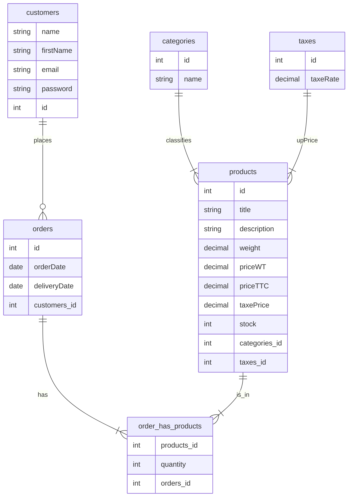
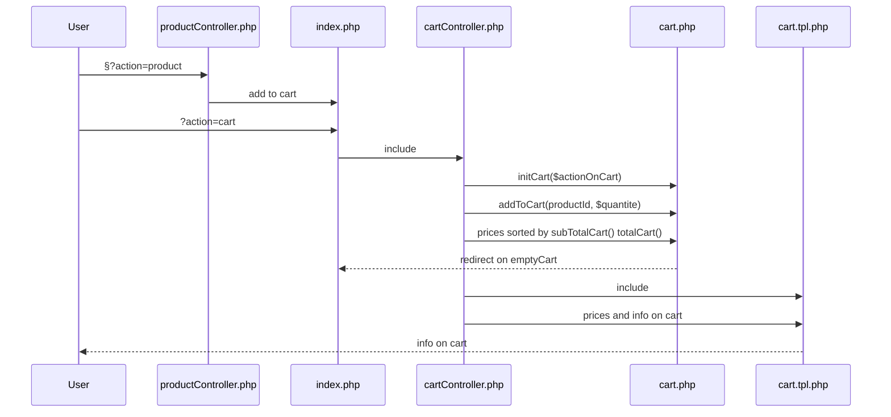

# diagrammes liés au projet de site marchand
## diagramme de la base de données

```mermaid
erDiagram
    customers ||--o{ orders : places
    customers {
        string name
        string firstName
        string email
        string password
        int id
    }
    orders ||--|{ order_has_products : has
    orders {
        int id
        date orderDate
        date deliveryDate
        int customers_id
    }
	order_has_products  {
        int products_id
        int quantity
        int orders_id
    }
	products ||--|{ order_has_products : is_in
	products {
				int id
				string title
				string description
				decimal weight
				decimal priceWT
				decimal priceTTC
				decimal taxePrice
				int stock
				int categories_id
				int taxes_id
	}
	categories ||--|{ products : classifies
	categories {
				int id
				string name
	}
	taxes ||--|{ products : upPrice
		taxes {
				int id
				decimal taxeRate
	}
```
## diagramme de la gestion du panier

```mermaid
sequenceDiagram

	User->>productController.php: §?action=product
	productController.php->>index.php: add to cart
	    User->>index.php: ?action=cart
    index.php->>cartController.php: include
    cartController.php->>cart.php: initCart($actionOnCart)

    cartController.php->>cart.php: addToCart(productId, $quantite)
	cartController.php->>cart.php: prices sorted by subTotalCart() totalCart()
	    cart.php-->>index.php: redirect on emptyCart
    cartController.php->>cart.tpl.php: include
    cartController.php->>cart.tpl.php: prices and info on cart
    cart.tpl.php -->>User: info on cart
```